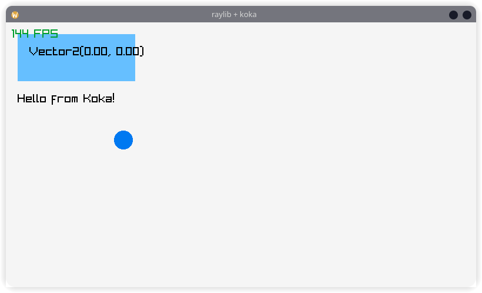

# Raylib bindings for koka programming language



Running game example

```bash
koka game.kk -e \
  --ccopts="$(pkg-config --cflags raylib)" \
  --cclinkopts="$(pkg-config --libs raylib)"
```

Setup can be done with nix
```
nix develop
```
